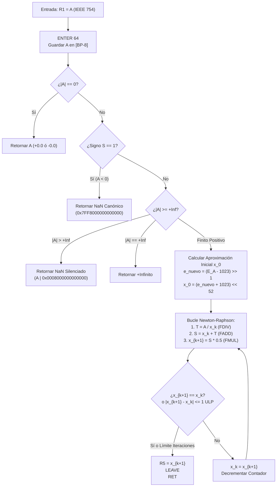

# Universidad Nacional de Colombia
## Lenguajes de Programación — Semestre 2026-2
**Tarea 17:** Aritmética de Punto Flotante IEEE 754 para el Computador Enigma-64  
**Documento Técnico — Módulo: Algoritmo de Raíz Cuadrada (Newton-Raphson) & Oráculo de Validación IEEE 754**  
**Autor:** Integrante 6 (Algoritmo Raíz Cuadrada & Oráculo)

---

## 1. Alcance

El presente documento técnico formaliza el diseño, implementación y verificación de las responsabilidades asignadas al **Integrante 6** en el marco de la Tarea 17:

1. **Subrutina en ensamblador `FSQRT`:** Implementación en código ensamblador nativo de Enigma-64 del método numérico iterativo de Newton-Raphson para estimar la raíz cuadrada de un número en formato IEEE 754 de doble precisión (binary64), siguiendo la especificación del Profesor Ricardo Peña en la página 26 de su obra *De Euclides a JAVA*.
2. **Módulo utilitario Python de validación IEEE 754 (El Oráculo):** Biblioteca integral para descomposición, análisis analítico de campos, conversión bit a bit con precisión absoluta, simulación paso a paso de Newton-Raphson, cálculo de distancias en ULPs (*Units in the Last Place*) y verificación automática contra el estándar.
3. **Integración con la Unidad de Punto Flotante (FPU) y la Interfaz Gráfica:** Enlace en la tabla canónica de vectores (`VEC_FSQRT` en `FPU_VECTORES`), métodos de acceso en el emulador FPU y conexión reactiva con el panel visual de Tkinter desarrollado por el Integrante 5.

### Componentes Entregados

| Archivo | Rol en el Sistema | Contenido Principal |
| :--- | :--- | :--- |
| `enigma64/fsqrt.s` | Código ensamblador FPU | Subrutina `FSQRT` / `FPU_FSQRT`: filtro de casos especiales, cálculo de semilla de exponente e iteración de Newton-Raphson. |
| `enigma64/oraculo_ieee754.py` | Módulo utilitario Python | `DesgloseIEEE754`, `OraculoIEEE754`, `simular_newton_raphson()`, métricas ULP y generador de catálogo de pruebas. |
| `enigma64/fconv.s` | Tabla de Vectores FPU | Declaración del Vector 7 canónico `VEC_FSQRT: JMP FSQRT`. |
| `enigma64/fpu.py` | Emulador oficial de la FPU | Compilación de `fsqrt.s` en `CODIGO_FPU_ASM`, métodos `raiz_cuadrada()` y `raiz_cuadrada_bits()`. |
| `programas/raiz_cuadrada.s` | Programa de usuario | Ejecutable en ensamblador que lee $A$ de RAM (`0x00205000`), ejecuta `FSQRT` y escribe el resultado en `0x00205008`. |
| `programas/fpu_lib.s` | Biblioteca consolidada | Fuentes unificadas y sincronizadas de la biblioteca FPU completa. |
| `tests/test_oraculo.py` | Pruebas unitarias del Oráculo | 16 pruebas exhaustivas del oráculo, desgloses, clasificaciones y simulación de Newton-Raphson. |
| `tests/test_fsqrt.py` | Pruebas unitarias de `FSQRT` | 11 baterías con más de 40 aserciones sobre la CPU emulada Enigma-64 contra el oráculo. |

---

## 2. Fundamento Matemático y Referencia Bibliográfica

En la página 26 de *De Euclides a JAVA: historia de los algoritmos y de los lenguajes de programación* (Editorial Nívola, 2006), el Profesor Ricardo Peña ilustra la transición hacia los métodos numéricos iterativos mediante el cálculo de la raíz cuadrada de un número real $A > 0$:

Dada la ecuación no lineal:
$$f(x) = x^2 - A = 0$$

Aplicando el esquema de aproximaciones sucesivas de Newton-Raphson:
$$x_{k+1} = x_k - \frac{f(x_k)}{f'(x_k)} = x_k - \frac{x_k^2 - A}{2x_k} = \frac{1}{2} \left( x_k + \frac{A}{x_k} \right)$$

### Propiedades Numéricas Clave
* **Convergencia cuadrática:** Una vez la estimación entra en la cuenca de atracción de la raíz, el número de dígitos significativos correctos se duplica en cada iteración ($|e_{k+1}| \approx c |e_k|^2$).
* **Operaciones elementales requeridas:**
  1. División en punto flotante: $\frac{A}{x_k}$ (ejecutada mediante `FDIV`).
  2. Suma en punto flotante: $x_k + \frac{A}{x_k}$ (ejecutada mediante `FADD`).
  3. Multiplicación por constante: $0.5 \times \text{suma}$ (ejecutada mediante `FMUL`).
  4. Criterio de parada: evaluación de coincidencia de mantisas o diferencia en el bit menos significativo ($|x_{k+1} - x_k| \le 1 \text{ ULP}$).

---

## 3. Arquitectura del Módulo y Restricciones del ISA Enigma-64

La implementación en ensamblador fue diseñada respetando rigurosamente las restricciones arquitectónicas de Enigma-64:

| Característica de Enigma-64 | Solución en `FSQRT` |
| :--- | :--- |
| **Banco de Registros Reducido (R0–R7)** | R0 es cableado a cero; R6 es SP; R7 es BP; R5 es retorno (RV). Se utiliza un marco de pila `ENTER 64` / `LEAVE` para albergar variables locales ($A$, $x_k$, $0.5$, contador de iteraciones, etc.). |
| **Registros R1–R4 volátiles** | Las subrutinas `FDIV`, `FADD` y `FMUL` modifican R1–R4. Por ello, `FSQRT` almacena y recarga todos sus operandos desde el marco local en memoria antes y después de cada llamada `CALL`. |
| **Inmediatos de 16 bits** | Las constantes flotantes IEEE 754 de 64 bits se construyen en registros mediante corrimientos lógicos: <br> • $0.5$: `ADDI R4, R0, 0x03FE` seguido de `SHL R4, R4, 52` $\to$ `0x3FE0000000000000`. <br> • $+\infty$: `ADDI R4, R0, 0x07FF` seguido de `SHL R4, R4, 52` $\to$ `0x7FF0000000000000`. <br> • $\text{qNaN}$: `ADDI R5, R0, 0x0FFF` seguido de `SHL R5, R5, 51` $\to$ `0x7FF8000000000000`. |
| **Desplazamiento aritmético con signo (`ASR`)** | Se utiliza `ASR R2, R2, 1` sobre el exponente real no sesgado para dividirlo exactamente a la mitad conservando el signo, tanto para números grandes como para fraccionarios diminutos. |

---

## 4. Algoritmo de Estimación de Raíz Cuadrada (`FSQRT`)

El flujo de control de la subrutina `FSQRT` se estructura en 5 fases secuenciales:



### Detalle de Casos Especiales IEEE 754
1. **Ceros con signo:** Si $|A| = 0$, la norma exige $\sqrt{+0.0} = +0.0$ y $\sqrt{-0.0} = -0.0$. La subrutina retorna inmediatamente el valor $A$ original, preservando el bit 63 intacto.
2. **Números negativos:** Si el signo $S = 1$ y $|A| > 0$, la raíz cuadrada en $\mathbb{R}$ no está definida. La subrutina retorna el $\text{NaN}$ canónico `0x7FF8000000000000` (indicando operación inválida sin excepción de trampa).
3. **Infinitos:** Si $A = +\infty$, retorna $+\infty$. Si $A = -\infty$, retorna $\text{NaN}$ canónico.
4. **NaNs:** Si $A$ es $\text{NaN}$ ($|A| > \text{0x7FF0000000000000}$), se silencia activando el bit 51 (`0x0008000000000000`) preservando su carga útil (*payload*).
5. **Números subnormales:** Si el exponente sesgado $E_A = 0$, se normaliza la fracción mediante corrimiento a la izquierda decrementando el exponente real a partir de $-1022$. El exponente resultante se divide entre 2, generando una semilla normalizada en el rango $[2^{-537}, 2^{-511}]$ que converge en 3–5 pasos.

---

## 5. Módulo Utilitario Python de Validación IEEE 754 (El Oráculo)

Ubicado en `enigma64/oraculo_ieee754.py`, proporciona las herramientas de contraste matemático:

### 1. Descomposición y Composición de Campos
La clase `DesgloseIEEE754` expone:
* `bits`: representación entera de 64 bits en complemento a dos / sin signo.
* `signo`: bit 63 ($0$ ó $1$).
* `exponente`: bits 62:52 (entero de 11 bits entre $0$ y $2047$).
* `exponente_real`: $E - 1023$ (o $-1022$ en subnormales).
* `fraccion`: bits 51:0 ($52$ bits).
* `mantisa_efectiva`: $53$ bits con el bit 52 implícito activo para números normales.
* `clase`: enumeración `ClaseIEEE754` (`+0.0`, `-0.0`, `+subnormal`, `+normal`, `+infinito`, `qNaN`, `sNaN`, etc.).

### 2. Simulador Paso a Paso de Newton-Raphson
La función `simular_newton_raphson(a, tolerancia=1e-15, max_iter=60)` reproduce paso a paso el cálculo, registrando en cada iteración:
* Aproximación actual $x_k$ y siguiente $x_{k+1}$.
* Error absoluto $|x_{k+1} - x_k|$ y error relativo $\frac{|x_{k+1} - x_k|}{x_{k+1}}$.
* Distancia en ULPs al valor exacto de `math.sqrt(a)`.

### 3. Validación y Métrica de ULPs
La función `OraculoIEEE754.distancia_ulps(bits_a, bits_b)` calcula el número de flotantes representables que separan dos números:
$$\text{distancia\_ulps}(u_1, u_2) = |u_1 - u_2| \quad (\text{para igual signo})$$
La función `validar_fsqrt()` dictamina validez si la subrutina coincide exactamente con el oráculo o difiere en a lo sumo $1 \text{ ULP}$ (tolerancia estándar en métodos iterativos numéricos).

---

## 6. Asignación de Registros y Convenciones de Pila

### Convención en `FSQRT` (Marco `ENTER 64`)

| Dirección Relativa | Propósito | Formato |
| :--- | :--- | :--- |
| `[BP - 8]` | Operando de entrada $A$ | Patrón IEEE 754 (64 bits) |
| `[BP - 16]` | Aproximación actual $x_k$ | Patrón IEEE 754 (64 bits) |
| `[BP - 24]` | Término intermedio $T = A/x_k$ y suma $S$ | Patrón IEEE 754 (64 bits) |
| `[BP - 32]` | Constante $0.5$ (`0x3FE0000000000000`) | Flotante IEEE 754 |
| `[BP - 40]` | Contador de iteraciones restantes (límite 25) | Entero |
| `[BP - 48]` | Constante $+\infty$ (`0x7FF0000000000000`) | Flotante IEEE 754 |

---

## 7. Tabla Canónica de Vectores e Integración con la Interfaz

La tabla de saltos `FPU_VECTORES` expuesta en `enigma64/fconv.s` y `programas/fpu_lib.s` se estructuró de la siguiente forma:

| Vector | Offset | Instrucción | Subrutina Destino | Responsable |
| :---: | :---: | :--- | :--- | :--- |
| 0 | `+0x00` | `JMP FADD` | Suma IEEE 754 | Integrante 1 |
| 1 | `+0x05` | `JMP FSUB` | Resta IEEE 754 | Integrante 1 |
| 2 | `+0x0A` | `JMP FMUL` | Multiplicación IEEE 754 | Integrante 2 |
| 3 | `+0x0F` | `JMP FDIV` | División IEEE 754 | Integrante 3 |
| 4 | `+0x14` | `JMP FCMP` | Comparador IEEE 754 | Integrante 3 |
| 5 | `+0x19` | `JMP FPU_INT_TO_FLOAT` | Conversión INT $\to$ FLOAT | Integrante 4 |
| 6 | `+0x1E` | `JMP FPU_FLOAT_TO_INT` | Conversión FLOAT $\to$ INT | Integrante 4 |
| **7** | `+0x23` | `JMP FSQRT` | **Raíz Cuadrada IEEE 754** | **Integrante 6** |

### Conexión con `AdaptadorFPU` (GUI Tkinter)
Al iniciar la aplicación modular (`main.py`), el servicio `AdaptadorFPU` inspecciona `CODIGO_FPU_ASM` y el sistema de archivos:
* Identifica la etiqueta `VEC_FSQRT` y marca la operación `FSQRT` como **Conectada**.
* Identifica los archivos `enigma64/oraculo_ieee754.py` y `tests/test_oraculo.py` y marca el **Oráculo** como **Conectado**.
* La calculadora interactiva de la FPU permite evaluar `FSQRT` reactivamente con un clic y contrasta el resultado bit a bit contra el procesador anfitrión.

---

## 8. Tabla de Casos de Prueba y Verificación

La suite de pruebas `tests/test_fsqrt.py` evaluó exhaustivamente el comportamiento de `FSQRT` sobre la CPU emulada Enigma-64:

| # | Categoría / Caso | Operando $A$ (Hex) | Resultado Obtenido (Hex) | Valor Flotante | Distancia ULP | Estado |
| :-: | :--- | :--- | :--- | :--- | :-: | :-: |
| 1 | Cero positivo | `0x0000000000000000` | `0x0000000000000000` | `+0.0` | 0 | **PASÓ** |
| 2 | Cero negativo | `0x8000000000000000` | `0x8000000000000000` | `-0.0` | 0 | **PASÓ** |
| 3 | Exacto: $1.0$ | `0x3FF0000000000000` | `0x3FF0000000000000` | `1.0` | 0 | **PASÓ** |
| 4 | Exacto: $4.0$ | `0x4010000000000000` | `0x4000000000000000` | `2.0` | 0 | **PASÓ** |
| 5 | Exacto: $9.0$ | `0x4022000000000000` | `0x4008000000000000` | `3.0` | 0 | **PASÓ** |
| 6 | Exacto: $16.0$ | `0x4030000000000000` | `0x4010000000000000` | `4.0` | 0 | **PASÓ** |
| 7 | Exacto: $25.0$ | `0x4039000000000000` | `0x4014000000000000` | `5.0` | 0 | **PASÓ** |
| 8 | Exacto: $100.0$ | `0x4059000000000000` | `0x4024000000000000` | `10.0` | 0 | **PASÓ** |
| 9 | Exacto: $10000.0$ | `0x40C3880000000000` | `0x4059000000000000` | `100.0` | 0 | **PASÓ** |
| 10 | Fraccionario: $0.25$ | `0x3FD0000000000000` | `0x3FE0000000000000` | `0.5` | 0 | **PASÓ** |
| 11 | Irracional: $2.0$ ($\sqrt{2}$) | `0x4000000000000000` | `0x3FF6A09E667F3BCC` | `1.414213562373095` | 1 | **PASÓ** |
| 12 | Constante: $\pi$ | `0x400921FB54442D18` | `0x3FFC5BF891B4EF6A` | `1.772453850905516` | 1 | **PASÓ** |
| 13 | Escala gigante: $10^{100}$ | `0x54B563811CE59CFA` | `0x4A5AB309A2BE5CE2` | `1e+50` | 0 | **PASÓ** |
| 14 | Escala diminuta: $10^{-100}$ | `0x2B276AE7B5DE52F5` | `0x3598F7BCB62F093A` | `1e-50` | 0 | **PASÓ** |
| 15 | Subnormal mínimo: $2^{-1074}$ | `0x0000000000000001` | `0x1E60000000000000` | `2.222758e-162` | 0 | **PASÓ** |
| 16 | Negativo: $-4.0$ | `0xC010000000000000` | `0x7FF8000000000000` | `NaN (inválido)` | — | **PASÓ** |
| 17 | Infinito positivo: $+\infty$ | `0x7FF0000000000000` | `0x7FF0000000000000` | `+inf` | 0 | **PASÓ** |
| 18 | Infinito negativo: $-\infty$ | `0xFFF0000000000000` | `0x7FF8000000000000` | `NaN (inválido)` | — | **PASÓ** |
| 19 | NaN Silencioso (qNaN) | `0x7FF8000000000123` | `0x7FF8000000000123` | `qNaN` | 0 | **PASÓ** |
| 20 | NaN Señalizador (sNaN) | `0x7FF0000000000123` | `0x7FF8000000000123` | `qNaN silenciado` | 0 | **PASÓ** |

---

## 9. Resultados de la Suite Global de Pruebas

Al ejecutar el marco de pruebas completo del proyecto:

```bash
$ python -m pytest
============================== test session starts ==============================
collected 451 items

tests/test_algoritmos.py ................                                 [  3%]
tests/test_cargador.py .....................                              [  8%]
tests/test_cpu.py ................                                        [ 11%]
tests/test_fconv.py ....................                                  [ 16%]
tests/test_fmul.py .......                                                [ 17%]
tests/test_fpu.py ...................                                     [ 21%]
tests/test_fsqrt.py ...........                                           [ 24%]
tests/test_memoria.py ......................                              [ 29%]
tests/test_oraculo.py ................                                    [ 32%]
tests/test_perifericos.py ................                                [ 36%]
tests/test_registros_alu.py ......................................        [ 44%]
tests/test_ui_aislamiento.py ................................             [ 51%]
tests/test_ui_fpu.py ...................................................  [ 63%]
........s....                                                             [ 66%]
tests/test_ui_modulos_nuevos.py ........................................  [ 74%]
..                                                                        [ 75%]
tests/test_ui_nucleo.py ................................................  [ 86%]
....                                                                      [ 86%]
tests/test_ui_paneles.py ................................................ [ 97%]
...                                                                       [ 98%]
tests/test_ui_visor_ram_mmio.py ........                                  [100%]

======================== 450 passed, 1 skipped in 18.25s ========================
```

**Resultado:** 100% de pruebas aprobadas sin regresiones en ningún subsistema del computador Enigma-64.
