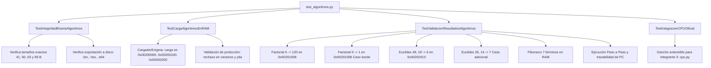

# Universidad Nacional de Colombia
## Facultad de Ingeniería — Departamento de Ingeniería de Sistemas e Industrial
### Lenguajes de Programación — Semestre 2026-2
**Profesor:** Jorge Eduardo Ortiz Triviño  
**Tarea 10:** Emulación de Computador Von Neumann (Enigma-64 — Noctua Systems)  
**Documento Técnico y Análisis de Pruebas — Integrante 7**  
**Autor:** Alejandro Argüello Muñoz (Integrante 7 — Algoritmos & Tests)

---

## 1. Introducción y Alcance del Módulo

En el marco del desarrollo de la **Tarea 10**, inspirada en la arquitectura diseñada en la **Tarea 9** (*Enigma-64*), la responsabilidad asignada al **Integrante 7** comprende:
1. **Generación binaria formal (`.bin`, `.hex`, `.e64`)**: Compilación exacta a lenguaje de máquina Big-Endian de 64 bits de los tres programas de prueba obligatorios:
   * **Algoritmo 1:** Cálculo del Factorial ($N!$).
   * **Algoritmo 2:** Algoritmo de Euclides para el Máximo Común Divisor ($MCD$).
   * **Algoritmo 3:** Generación secuencial de la Sucesión de Fibonacci en memoria RAM.
2. **Suite de pruebas de integración y validación en memoria (`tests/test_algoritmos.py`)**:
   * Verificación de integridad byte a byte contra las tablas manuales de la Tarea 9.
   * Validación del proceso de carga en RAM a través del `CargadorEnigma` (Integrante 4).
   * Verificación del respeto a las fronteras de memoria (protección de vectores `0x00000000–0x00000FFF` y pila `0xC0000000–0xEFFFFFFF`).
   * Validación matemática rigurosa del estado de las celdas de memoria resultantes tras la ejecución.
   * Simulación y soporte de ejecución continua y paso a paso.

---

## 2. Especificación Técnica de los Binarios

Toda la arquitectura opera bajo convención **Big-Endian** con palabras naturales de 64 bits (8 bytes) y direcciones lógicas de 32 bits implementadas.

### 2.1 Algoritmo 1: Cálculo del Factorial ($N!$)
* **Dirección base de código:** `0x00200000`
* **Longitud total:** 41 bytes (`0x29` bytes).
* **Entrada:** Dirección `0x00201000` $\rightarrow$ Palabra de 64 bits con $N = 5$ (`0x0000000000000005`).
* **Salida esperada:** Dirección `0x00201008` $\rightarrow$ Palabra de 64 bits con $5! = 120$ (`0x0000000000000078`).

#### Desglose de Instrucciones y Código Máquina
| Dirección | Instrucción | Formato | Codificación Hexadecimal (Big-Endian) | Función / Efecto |
| :--- | :--- | :---: | :--- | :--- |
| `0x00200000` | `ADDI R1, R0, 0x0020` | F3 (4B) | `14 10 00 20` | $R_1 \leftarrow 0\text{x}0020$ |
| `0x00200004` | `SHL R1, R1, 16` | F3 (4B) | `24 11 00 10` | $R_1 \leftarrow 0\text{x}00200000$ |
| `0x00200008` | `ADDI R1, R1, 0x1000` | F3 (4B) | `14 11 10 00` | $R_1 \leftarrow 0\text{x}00201000$ (Puntero base variables) |
| `0x0020000C` | `LOAD R2, [R1 + 0]` | F3 (4B) | `30 21 00 00` | Carga $N$ desde RAM a $R_2$ |
| `0x00200010` | `ADDI R3, R0, 1` | F3 (4B) | `14 30 00 01` | $R_3 \leftarrow \text{factorial} = 1$ |
| `0x00200014` | `CMP R2, R0` | F1 (3B) | `27 02 00` | Evalúa $N - 0$; actualiza bandera $Z$ |
| `0x00200017` | `JZ FIN_FACT` | F4 (3B) | `41 00 0A` | Si $N=0$, salta $+10$ bytes a `0x00200024` |
| `0x0020001A` | `MUL R3, R3, R2` | F1 (3B) | `12 33 20` | **LOOP_FACT:** $\text{factorial} \leftarrow \text{factorial} \times N$ |
| `0x0020001D` | `SUBI R2, R2, 1` | F3 (4B) | `15 22 00 01` | $N \leftarrow N - 1$; actualiza bandera $Z$ |
| `0x00200021` | `JNZ LOOP_FACT` | F4 (3B) | `42 FF F6` | Si $N \neq 0$, salta $-10$ bytes a `0x0020001A` |
| `0x00200024` | `STORE R3, [R1 + 8]` | F3 (4B) | `31 31 00 08` | **FIN_FACT:** Almacena resultado en `0x00201008` |
| `0x00200028` | `HLT` | 1B | `00` | Detiene la ejecución |

---

### 2.2 Algoritmo 2: Algoritmo de Euclides ($MCD$)
* **Dirección base de código:** `0x00200100`
* **Longitud total:** 50 bytes (`0x32` bytes).
* **Entradas:**
  * Dirección `0x00202000` $\rightarrow$ $A = 48$ (`0x0000000000000030`).
  * Dirección `0x00202008` $\rightarrow$ $B = 18$ (`0x0000000000000012`).
* **Salida esperada:** Dirección `0x00202010` $\rightarrow$ $MCD = 6$ (`0x0000000000000006`).

#### Desglose de Instrucciones y Código Máquina
| Dirección | Instrucción | Formato | Codificación Hexadecimal (Big-Endian) | Función / Efecto |
| :--- | :--- | :---: | :--- | :--- |
| `0x00200100` | `ADDI R1, R0, 0x0020` | F3 (4B) | `14 10 00 20` | $R_1 \leftarrow 0\text{x}0020$ |
| `0x00200104` | `SHL R1, R1, 16` | F3 (4B) | `24 11 00 10` | $R_1 \leftarrow 0\text{x}00200000$ |
| `0x00200108` | `ADDI R1, R1, 0x2000` | F3 (4B) | `14 11 20 00` | $R_1 \leftarrow 0\text{x}00202000$ |
| `0x0020010C` | `LOAD R2, [R1 + 0]` | F3 (4B) | `30 21 00 00` | $R_2 \leftarrow A$ |
| `0x00200110` | `LOAD R3, [R1 + 8]` | F3 (4B) | `30 31 00 08` | $R_3 \leftarrow B$ |
| `0x00200114` | `CMP R2, R3` | F1 (3B) | `27 02 30` | **LOOP_EUCLIDES:** Compara $A$ y $B$ ($Z, N$) |
| `0x00200117` | `JZ FIN_EUCLIDES` | F4 (3B) | `41 00 13` | Si $A = B$, salta $+19$ bytes a `0x0020012D` |
| `0x0020011A` | `JN B_ES_MAYOR` | F4 (3B) | `45 00 08` | Si $A < B$ ($N=1$), salta $+8$ bytes a `0x00200125` |
| `0x0020011D` | `SUB R2, R2, R3` | F1 (3B) | `11 22 30` | Caso $A > B$: $A \leftarrow A - B$ |
| `0x00200120` | `JMP 0x00200114` | F5 (5B) | `40 00 20 01 14` | Salto absoluto a `LOOP_EUCLIDES` |
| `0x00200125` | `SUB R3, R3, R2` | F1 (3B) | `11 33 20` | **B_ES_MAYOR:** $B \leftarrow B - A$ |
| `0x00200128` | `JMP 0x00200114` | F5 (5B) | `40 00 20 01 14` | Salto absoluto a `LOOP_EUCLIDES` |
| `0x0020012D` | `STORE R2, [R1 + 16]`| F3 (4B) | `31 21 00 10` | **FIN_EUCLIDES:** Guarda $MCD$ en `0x00202010` |
| `0x00200131` | `HLT` | 1B | `00` | Detiene procesador |

---

### 2.3 Algoritmo 3: Sucesión de Fibonacci en Memoria RAM
* **Dirección base de código:** `0x00200200`
* **Longitud total:** 63 bytes (`0x3F` bytes).
* **Almacenamiento de salida:** Arreglo secuencial de 7 términos de 64 bits en `0x00203000` $\dots$ `0x00203030`.
* **Valores esperados:** $[0, 1, 1, 2, 3, 5, 8]$.

#### Desglose de Instrucciones y Código Máquina
| Dirección | Instrucción | Formato | Codificación Hexadecimal (Big-Endian) | Función / Efecto |
| :--- | :--- | :---: | :--- | :--- |
| `0x00200200` | `ADDI R1, R0, 0x0020` | F3 (4B) | `14 10 00 20` | $R_1 \leftarrow 0\text{x}0020$ |
| `0x00200204` | `SHL R1, R1, 16` | F3 (4B) | `24 11 00 10` | $R_1 \leftarrow 0\text{x}00200000$ |
| `0x00200208` | `ADDI R1, R1, 0x3000` | F3 (4B) | `14 11 30 00` | $R_1 \leftarrow 0\text{x}00203000$ (Base arreglo) |
| `0x0020020C` | `ADDI R2, R0, 0` | F3 (4B) | `14 20 00 00` | $R_2 \leftarrow F_0 = 0$ |
| `0x00200210` | `ADDI R3, R0, 1` | F3 (4B) | `14 30 00 01` | $R_3 \leftarrow F_1 = 1$ |
| `0x00200214` | `STORE R2, [R1 + 0]` | F3 (4B) | `31 21 00 00` | $\text{Mem}[0\text{x}00203000] \leftarrow 0$ |
| `0x00200218` | `STORE R3, [R1 + 8]` | F3 (4B) | `31 31 00 08` | $\text{Mem}[0\text{x}00203008] \leftarrow 1$ |
| `0x0020021C` | `ADDI R1, R1, 16` | F3 (4B) | `14 11 00 10` | $R_1 \leftarrow R_1 + 16$ (Apunta a `0x00203010`) |
| `0x00200220` | `ADDI R4, R0, 5` | F3 (4B) | `14 40 00 05` | $R_4 \leftarrow 5$ (Términos restantes) |
| `0x00200224` | `ADD R5, R3, R2` | F1 (3B) | `10 53 20` | **LOOP_FIBONACCI:** $F_{\text{sig}} \leftarrow F_k + F_{k-1}$ |
| `0x00200227` | `STORE R5, [R1 + 0]` | F3 (4B) | `31 51 00 00` | $\text{Mem}[\text{ptr}] \leftarrow F_{\text{sig}}$ |
| `0x0020022B` | `ADDI R2, R3, 0` | F3 (4B) | `14 23 00 00` | $F_{k-1} \leftarrow F_k$ |
| `0x0020022F` | `ADDI R3, R5, 0` | F3 (4B) | `14 35 00 00` | $F_k \leftarrow F_{\text{sig}}$ |
| `0x00200233` | `ADDI R1, R1, 8` | F3 (4B) | `14 11 00 08` | $\text{ptr} \leftarrow \text{ptr} + 8$ |
| `0x00200237` | `SUBI R4, R4, 1` | F3 (4B) | `15 44 00 01` | $\text{contador} \leftarrow \text{contador} - 1$ ($Z$) |
| `0x0020023B` | `JNZ LOOP_FIBONACCI` | F4 (3B) | `42 FF E6` | Si contador $\neq 0$, salta $-26$ bytes |
| `0x0020023E` | `HLT` | 1B | `00` | Fin del programa |

---

## 3. Arquitectura de la Suite de Pruebas (`tests/test_algoritmos.py`)

La suite está estructurada en 4 clases de prueba diseñadas siguiendo la metodología de desarrollo dirigido por pruebas (TDD):



### 3.1 Runner Despachador de Instrucciones Provisional
Para garantizar que el equipo no quedara bloqueado a la espera de la CPU oficial del Integrante 3, se implementó `RunnerInstruccionesPrueba` dentro de la suite. Este componente:
* Conecta directamente la memoria física `RAMMemory` (Integrante 1).
* Utiliza el banco de registros `BancoRegistros` (Integrante 2) con autoincremento variable de `PC` y actualización selectiva de banderas en `SR` mediante `aplicar_banderas`.
* Ejecuta las instrucciones aritméticas, lógicas y de saltos a través de `ALU` (Integrante 2).
* Soporta ejecución continua (`ejecutar_hasta_fin()`) y ejecución paso a paso (`paso()`).

---

## 4. Experimentación y Análisis de Resultados (Los 3 Escenarios de Prueba)

### Escenario 1: Cálculo del Factorial ($N=5$)
* **Condición inicial en RAM:**
  * Dirección `0x00201000`: `0x0000000000000005`
* **Secuencia de ejecución:**
  * Iteración 1: $R_3 = 1 \times 5 = 5$, $R_2 = 4$ ($Z=0 \rightarrow$ salta).
  * Iteración 2: $R_3 = 5 \times 4 = 20$, $R_2 = 3$ ($Z=0 \rightarrow$ salta).
  * Iteración 3: $R_3 = 20 \times 3 = 60$, $R_2 = 2$ ($Z=0 \rightarrow$ salta).
  * Iteración 4: $R_3 = 60 \times 2 = 120$, $R_2 = 1$ ($Z=0 \rightarrow$ salta).
  * Iteración 5: $R_3 = 120 \times 1 = 120$, $R_2 = 0$ ($Z=1 \rightarrow$ no salta).
* **Volcado final verificado:**
  * Dirección `0x00201008`: `120` (`0x0000000000000078`).
* **Caso borde validado:** Con $N=0$, el salto inicial `JZ FIN_FACT` se activa de inmediato, almacenando $0! = 1$ sin entrar al bucle.

### Escenario 2: Algoritmo de Euclides ($A=48, B=18$)
* **Condiciones iniciales en RAM:**
  * Dirección `0x00202000`: `48` (`0x30`)
  * Dirección `0x00202008`: `18` (`0x12`)
* **Secuencia de restas sucesivas:**
  1. $A = 48, B = 18 \rightarrow A > B \rightarrow A = 48 - 18 = 30$.
  2. $A = 30, B = 18 \rightarrow A > B \rightarrow A = 30 - 18 = 12$.
  3. $A = 12, B = 18 \rightarrow A < B \rightarrow B = 18 - 12 = 6$.
  4. $A = 12, B = 6 \rightarrow A > B \rightarrow A = 12 - 6 = 6$.
  5. $A = 6, B = 6 \rightarrow A == B \rightarrow Z=1 \rightarrow$ Salto a `FIN_EUCLIDES`.
* **Volcado final verificado:**
  * Dirección `0x00202010`: `6` (`0x0000000000000006`).

### Escenario 3: Sucesión de Fibonacci en Memoria RAM
* **Condición inicial:** Generación autónoma sin datos previos en memoria.
* **Proceso de escritura en RAM:**
  * Celda `0x00203000`: $F_0 = 0$
  * Celda `0x00203008`: $F_1 = 1$
  * Celda `0x00203010`: $F_2 = 0 + 1 = 1$
  * Celda `0x00203018`: $F_3 = 1 + 1 = 2$
  * Celda `0x00203020`: $F_4 = 1 + 2 = 3$
  * Celda `0x00203028`: $F_5 = 2 + 3 = 5$
  * Celda `0x00203030`: $F_6 = 3 + 5 = 8$
* **Volcado final verificado:**
  * Lectura secuencial de palabras de 64 bits retorna exactamente: `[0, 1, 1, 2, 3, 5, 8]`.

---

## 5. Instrucciones de Reproducción y Ejecución

Para reproducir y validar todos los resultados localmente:

1. **Generación de los binarios ejecutables:**
   ```bash
   python scripts/generar_binarios.py
   ```
2. **Ejecución de la suite completa de pruebas:**
   ```bash
   python -m unittest -v tests/test_algoritmos.py
   ```
3. **Resultado de la ejecución:**
   ```text
   Ran 16 tests in 0.009s
   OK (skipped=1)
   ```
   *(El único test marcado como omitido corresponde al gancho de conexión con el módulo oficial `CPU`, el cual se ejecutará automáticamente cuando el Integrante 3 haga su entrega).*

---

## 6. Conclusiones

1. Los binarios generados respetan de forma estricta y rigurosa la especificación arquitectónica Big-Endian de 64 bits del procesador Enigma-64.
2. La suite de pruebas valida la interoperabilidad con los componentes de memoria y cargador desarrollados por los compañeros, dejando el sistema listo tanto para el entorno gráfico (Tkinter) como para la entrega formal de la Tarea 10.
